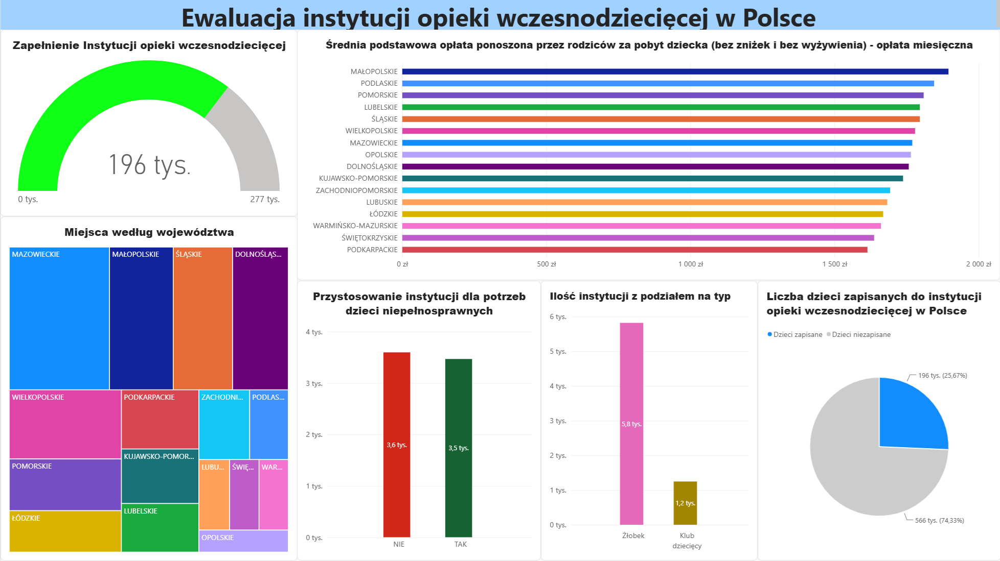

# 🚀 Data Journey #01: Power BI Basics & Government Data ETL

> **Status projektu:** 🟢 Ukończony (Kamień Milowy #1)  
> **Poziom:** Beginner / Early Engineer  
> **Główny nacisk:** Czyszczenie i transformacja danych (Power Query), Projektowanie UI/UX, Logika biznesowa  

---

## 📌 O Projekcie & Cel Edukacyjny
Głównym celem projektu było samodzielne zmierzenie się z surowymi, nienormowanymi danymi rządowymi dotyczącymi **instytucji opieki wczesnodziecięcej w Polsce** i przekształcenie ich w czytelny, biznesowy dashboard.

---

## 🛠️ Wykorzystane Narzędzia & Technologie
* **Power BI Desktop** (Wizualizacja, Layout & Kontekst filtrowania)
* **Power Query / ETL** (Czyszczenie danych, zmiana typów danych, usuwanie wartości NULL)
* **Otwarte Dane Rządowe** (Data Source)

---

## 💡 Kluczowe Wnioski i Logika Biznesowa
* **Wielopoziomowa Hierarchia (Drill-down):** Raport umożliwia dynamiczną analizę danych od poziomu ogólnokrajowego i województw aż do szczegółowego poziomu poszczególnych miast i gmin.
* **Interaktywna Analiza Dostępności:** Wykresy umożliwiają filtrowanie miejsc według typu placówki (żłobki vs. kluby dziecięce) oraz weryfikację dostosowania infrastruktury dla dzieci niepełnosprawnych.
* **Analiza Zapełnienia (Capacity Ratio):** Wykorzystanie wskaźnika typu Gauge do natychmiastowej oceny stopnia wykorzystania dostępnych miejsc w skali kraju i poszczególnych regionów.
---

## 📁 Pliki w Repozytorium
* `01_PowerBI_Opieka_Wczesnodziecieca.pbix` – Pełny plik raportu Power BI
* `dashboard_preview.png` – Zrzut ekranu raportu
